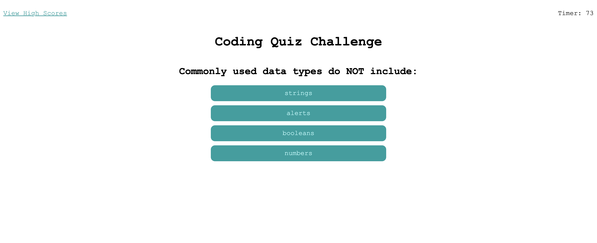

# Coding Quiz Challenge

## UCLA Bootcamp Module 4 Assignment

## Description

This project is a coding challenge quiz. It operates as follows:

1. The user will be given an amount of time to complete the quiz. 
2. The timer will start when the user clicks the start button.
3. The user will be presented with a question and able to click the answer.
4. The user will be told if the answer was correct or incorrect.
5. If they answer a question wrong, their time is deducted. 
6. At the end of the quiz questions or when the timer runs out, their final score is the time left on the clock.
7. When the game is over, the user will be able to save their name and score.
8. When the user saves their score, they will be able to view high scores via the high scores page.

## Installation

This project can be accessed via Github Pages at https://ramitaarora.github.io/coding-quiz-challenge/.

## Usage

## Credits

This quiz was created by Ramita Indurkhya.